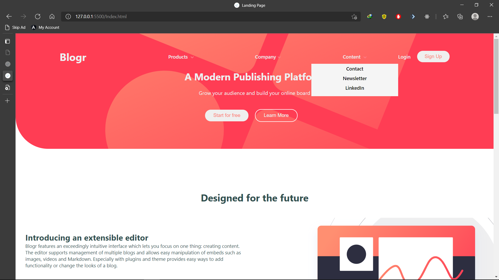

# Frontend Mentor - Blogr landing page solution

This is a solution to the [Blogr landing page challenge on Frontend Mentor](https://www.frontendmentor.io/challenges/blogr-landing-page-EX2RLAApP). Frontend Mentor challenges help you improve your coding skills by building realistic projects.

## Table of contents

- [Overview](#overview)
  - [The challenge](#the-challenge)
  - [Screenshot](#screenshot)
  - [Links](#links)
  - [Built with](#built-with)
  - [What I learned](#what-i-learned)
- [Author](#author)
- [Acknowledgments](#acknowledgments)

**Note: Delete this note and update the table of contents based on what sections you keep.**

## Overview

### The challenge

Users should be able to:

- View the optimal layout for the site depending on their device's screen size
- See hover states for all interactive elements on the page

### Screenshot

### Links

- Solution URL: [Solution](https://github.com/Codedzephyr/Blogr-landing-page-main)
- Live Site URL: [Live Site](https://festive-dijkstra-965ec1.netlify.app/)

### Built with

- Semantic HTML5 markup
- CSS custom properties
- CSS Grid
- Flexbox
- CSS Grid

### What I learned

Usage of flex,grid and position pertaining to css

### Continued development

Use this section to outline areas that you want to continue focusing on in future projects. These could be concepts you're still not completely comfortable with or techniques you found useful that you want to refine and perfect.

**Note: Delete this note and the content within this section and replace with your own plans for continued development.**

## Author

- Website - [Salihu Andulhamid](https://infallible-pike-a0b433.netlify.app/)
- Frontend Mentor - [@Codedzephyr](https://www.frontendmentor.io/profile/Codedzephyr)
- Twitter - [@dimah](https://www.twitter.com/dimah)

**Note: Delete this note and add/remove/edit lines above based on what links you'd like to share.**

## Acknowledgments

My Friend Ekeso helped me with this project.
